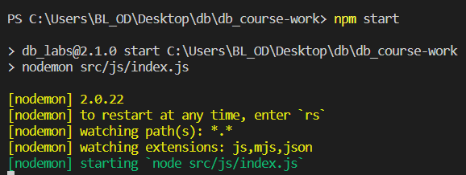
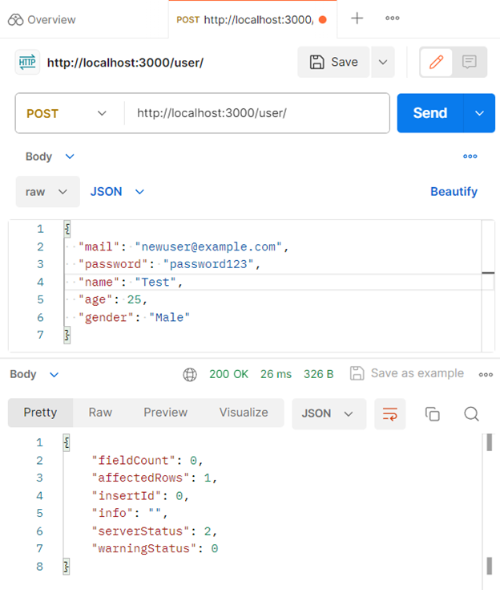
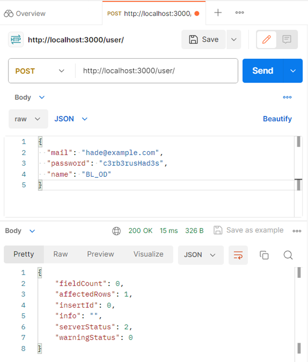
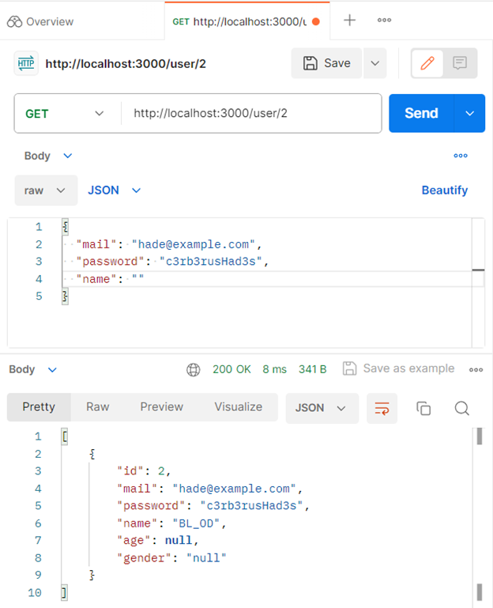
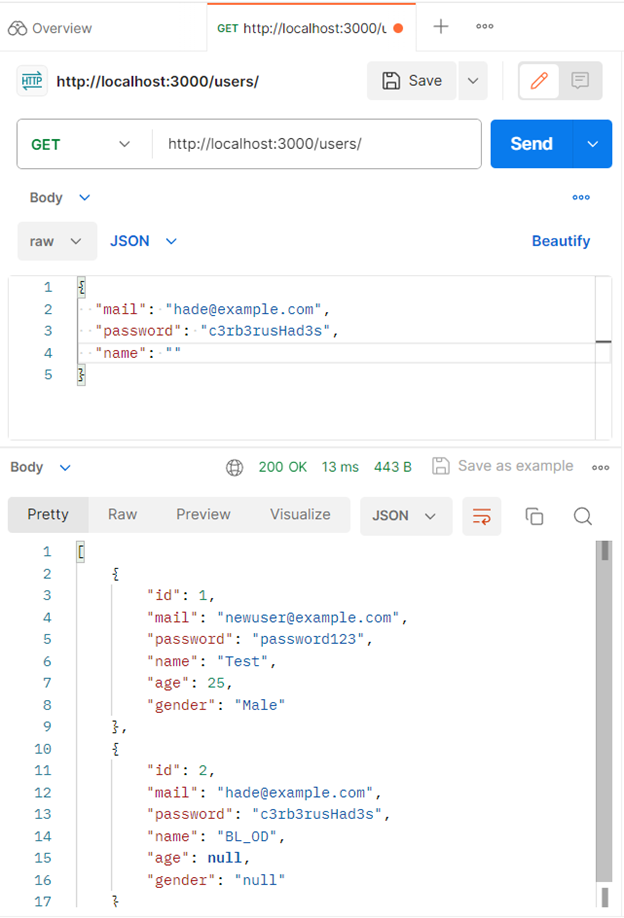
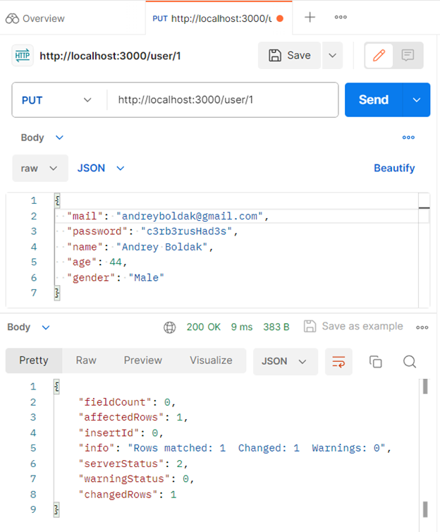
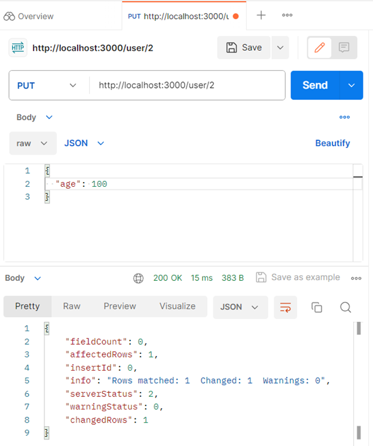
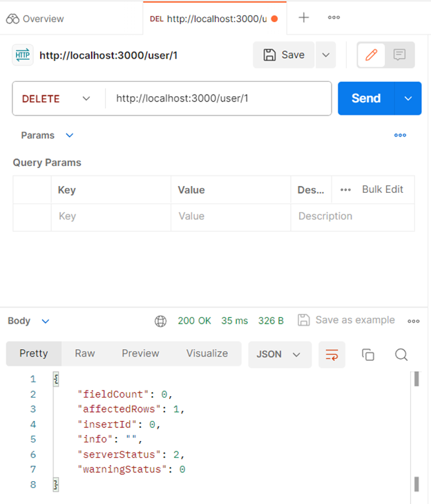
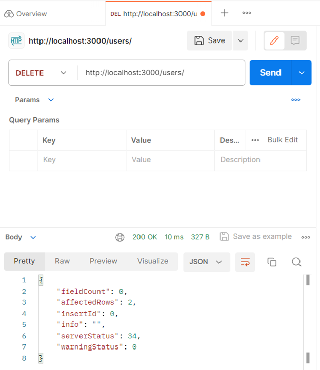

# Тестування працездатності системи

## Запуск системи

    

## Створення користувача (з уведенням age і gender)

    

## Створення користувача (без уведення age i gender)

    

## Отримання користувача за id

    

## Отримання всіх користувачів

    

## Оновлення користувача (усіх даних)

    

## Оновлення користувача (певну частину даних)

    

## Видалення користувача

    

##

    

